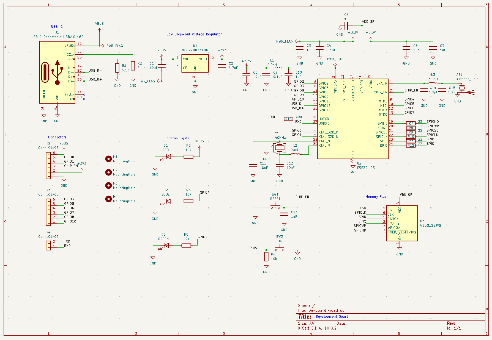
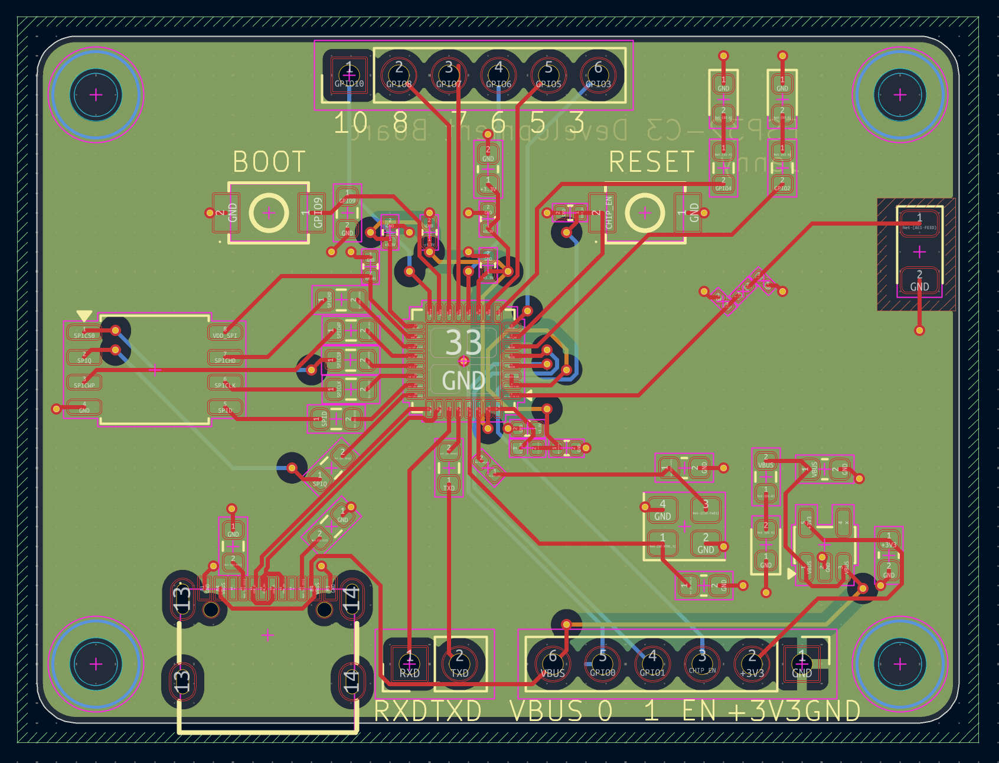
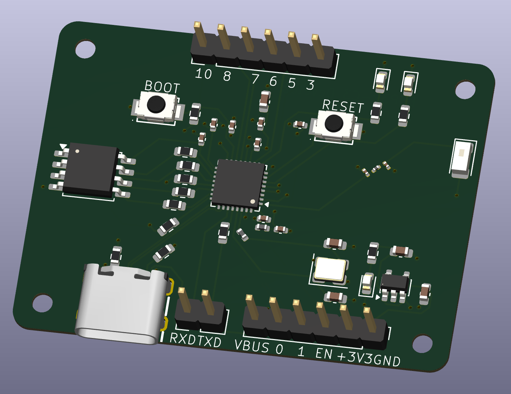

# Development Board

## Description
This is a 47x35mm development board PCB made with a bare bones ESP32-C3. It can support wireless connections which is useful. It contanis three pin headers, with one containing power supply gpio. The other one is GPIO only and lastly the 2 pins are for TXD and RXD. Uses USB-C to get power. Boot switch and reset switch helps to activate anything using the chip. Chip enable can be connected via pins.

There's a red power LED near USB-C. Blue and green located on top for testing LED on top for testing LED.

## KiCanvas

[Demo Link](https://kicanvas.org/?repo=https%3A%2F%2Fgithub.com%2Frocketblaster%2FDevboard%2Ftree%2Fmain%2Fsrc%2Fkicad)

## Schematic

## PCB

## Render

