## May 10, 2026
I wonder what dev boards are useful for. What problems do I want to solve? Some features I would add is to make my development board aesthetically pleasing. For easier connectivity I'm going to add USB connectors. Since my computer is primarily USB-C I will use USB-C. Also usb-c is just easier in general. I need a one way usb-c with one way anything. With the intent of adding a case too eventually. I want to protect my devboard in someway. But that means I need to leave slots option for pinouts if I do add them. I think I will go with RP2040 for general purpose. But I need to make it unique in some way. It doesn't have wifi support though. Some applications I want to use my development board might include wifi, for example temperature readings or a wifi-powered clock from the cloud. I think I'll stick with the ESP32.

This ESP32 has an internal 8 MHz oscillator as I read through the datasheet for the ESP32 chip. It does not need an 8 MHz crystal oscillator then. however the addition of external crystal clock sources are typical 160 MHz. so I'm adding a 160 MHz crysal clock source. I picked esp32-d0wd-v3.

I am finding the external crystal clock oscillator I found this one [here](https://www.lcsc.com/product-detail/C43086214.html?s_z=n_q_p_crystal%2520oscillators%2520160&spm=wm.ssy.bg.0.xh&lcsc_vid=QARcUlBTQQQLVlUEEVddVAJXRVhXUwYHT1YKX1xQQAUxVlNRT1VbU1NRQFNcUTsOAxUeFF5JWBYZEEoKFBINSQcJGk4dAgUUFAk%3D)

I think this is unusually a high frequency for crystal oscillator though. I am going to recheck. Besides there's not a lot of stock. Ok I rechecked and it is crystal 40 MHz for wifi or bluetooth. I found another one. It is called [YXC Crystal Oscillators OW2EL89CENUXK7YLC-40M](https://www.lcsc.com/product-detail/C48888233.html?s_z=n_q_p_crystal%2520oscillators%252040mhz&spm=wm.ssy.bg.2.xh&lcsc_vid=QARcUlBTQQQLVlUEEVddVAJXRVhXUwYHT1YKX1xQQAUxVlNRT1VbUlBQQFhfVjsOAxUeFF5JWBYZEEoKFBINSQcJGk4dAgUUFAk%3D) A 4 pin crystal

Now i need a linear regulator between power and mcu which is ESP32. Maximum operating voltage is 3.3v. USB-C supports 5v. I am going from 5v to 3.3v. Uh I'll pick the XC6206 or related because it supports up to specific volts and I want a USB-C connector. There's other manufacturers but this part has more in stock, so more popular. [MSKSEMI XC6206P332MR-MS](https://www.lcsc.com/product-detail/C5252899.html?spm=wm.fly.bg.1.xh___wm.mly.mlk.16-0-0.ml&lcsc_vid=T1UPBgAFQlJbX1JeE1QIVQZeFAcIAwZeQlUPX1BWElcxVlNRQFlbVF1TQlNcUTsOAxUeFF5JWBYZEEoKFBINSQcJGk4dAgUUFAk%3D)

Ok I forgot about the current limits. I wonder if my ESP32 model needs to handle specific levels of current. I went back to power supply and it says

"The operating voltage of ESP32 ranges from 2.3 V to 3.6 V. When using a single-power supply, the
recommended voltage of the power supply is 3.3 V, and its recommended output current is 500 mA or
more."

I need an output current of 500mA or more on ESP32. The previously mentioned LDO is not compatible most likely. I found this one and I'm going to read the datasheet. [TDSEMIC XC6220B331MR](https://www.lcsc.com/product-detail/C22466451.html?s_z=n_q_xc6220&spm=wm.fly.bg.0.xh&lcsc_vid=QARcUlBTQQQLVlUEEVddVAJXRVhXUwYHT1YKX1xQQAUxVlNRT1VbXlFeTlNZVjsOAxUeFF5JWBYZEEoKFBINSQcJGk4NBhADEA4cHktXR1JcSQwSGg0%3D)

It can support up to output of 300mA. For ESP32-C3 the current consumption in active mode for RF is peak 335 mA.

There are too many ESP32 models. Seems I'm looking for MCU specfically. I changed my mind. I pick the ESP32-C3 for wifi compatibility. I'm not intent to make a radio or anything. There is a specific data sheet so I will read it.

I found the hardware design guide. It says the power regulation be no less than 500 mA. This model I found works after some recommendations online. [TECH PUBLIC XC6220B301MR](https://www.lcsc.com/product-detail/C23378035.html?s_z=n_q_xc6220&spm=wm.fly.bg.2.xh&lcsc_vid=QARcUlBTQQQLVlUEEVddVAJXRVhXUwYHT1YKX1xQQAUxVlNRT1VYVlNVR1RYUjsOAxUeFF5JWBYZEEoKFBINSQcJGk4NBhADEA4cHktXR1JcSQwSGg0%3D) I like that it supports up to 900mA and 6v.

### Time Spent: 2 hr

## May 11, 2026

So the LDO I want does not have a footprint in the kicad library. No worries, I found a better alternative! I'm going to use the [XC6220B331MR-G](https://jlcpcb.com/partdetail/TorexSemicon-XC6220B331MRG/C86534) because it can support up to 1000mA! That's more than what I need but you never know. Just in case. I'm going to import this into the KiCad library.

I'm going to add a crystal somewhere too. It seems the one I picked contains 4 pinouts. So I will import a symbol with 4 pins as crystal. Actually it's a 3 pin because one of the pin is a no connect. Also I am not sure where the mcu pinout is so I'm reading the diagram right now.

The document mentions about an analog pin called XTAL_N and XTAL_P which is connected to "external clock input/output connected to the chip's crystal or oscillator. P/N means differential clock positive negative"

And XTAL_32K_N and XTAL_32K_P for a 32kHz external clock input or output connected to ESP32-C3's crystal or oscillator.

I think I'm not going for the 32kHZ external clock because I have a 40 MHz crystal. Connecting it to XTAL_N and XTAL_P.

LDO pin I find out

I don't know what CE and Vout goes to so I'll come back later.

Uh oh I read through the XC6220 and it's PCBA only. Come back later. Anyways I since the USB-C says VBUS I changed it to VBUS. I also have CC1 and CC2 but wired it to 5.1k pullup resistors as usual

My LDO needs capacitors to store some energy. I checked the data sheet and it says
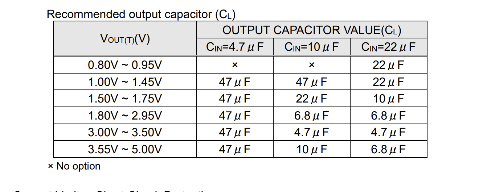

Maybe 47uF? Since it says voltage out. So I'm picking a 47uF capacitor then. But where does this go? After some researching, it seems my capacitor size depends on the crystal I have... I can 47 from what's recommended. It's hard to read. Datasheet wants a capacitor between VIN and VSS (ground). Same for VOut and VSS. Will also add somne net labels to the USB-C. I still have a CE pin left floating. It's an input pin. I will connect to Vin to keep it constantly on so it is open.

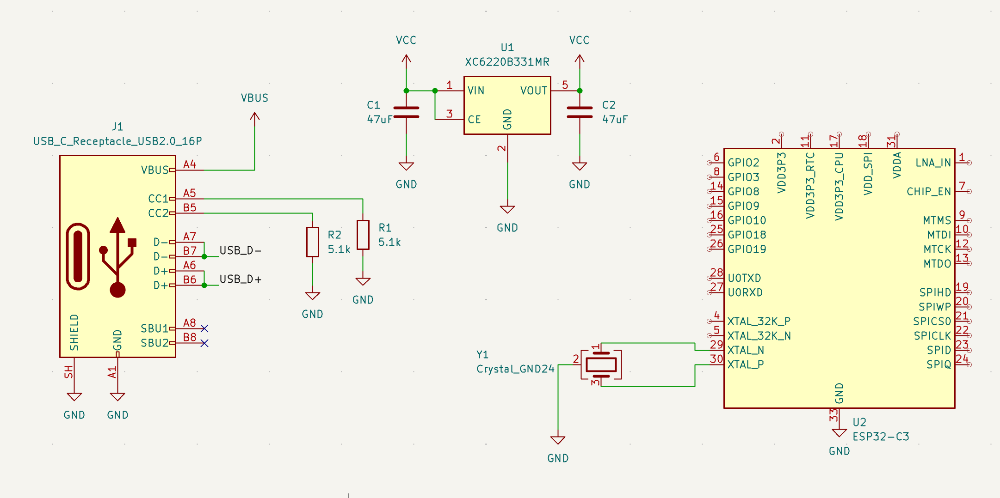

I'm moving on to the MCU. I have a lot of pins that start with V. Let's start by reading the datasheet and seeing what it says.

### Time Spent: 1 Hour

## May 12, 2026

Alright where I left off on was trying to wire up the VDD pinouts. So I'm going to read the datasheet.

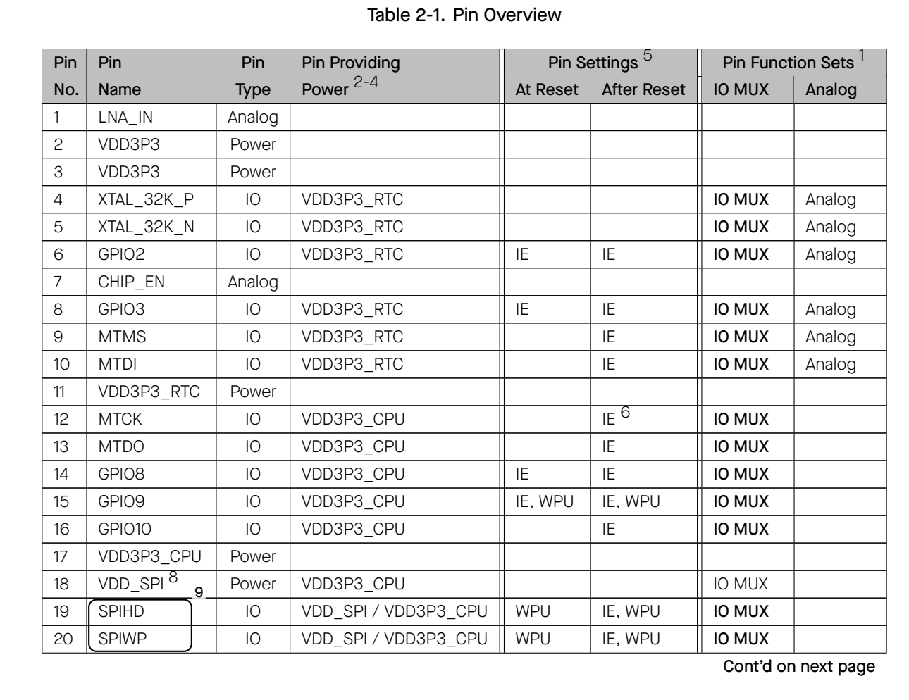

I wonder if I need any capacitors. It is unclear in the datasheet but maybe it is because i am not reading deep enough. But I guess they're all connected to capacitors which lead to ground. I'm following the hardware design schematic guide from the docs. I am told to connect 0.1uF or 100nF capacitors.

"When using a single power supply, the recommended power supply voltage is 3.3 V and the output current is no less than 500 mA.

It is suggested to add an ESD protection diode and at least 10 μF capacitor at the power entrance."

I am going to add a 10uF capacitor at the power entrance. I don't know what to do with VDD_SPI, a digital pin. It seems it wants to connect a 1uF to ground according to the datasheet. I'll just follow it. Then I rename my designator labels so the numbers read left to right.

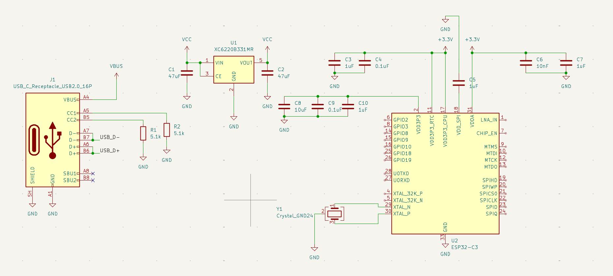

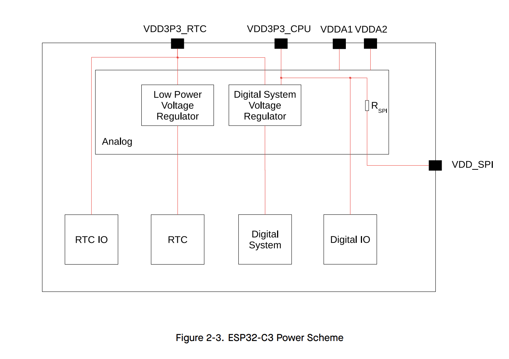

Oh also I found a better crystal. The one I originally found did not support 10.0ppm but this one does as it is also 40MHz. It is called [YXC Crystal Oscillators XL2EL89CPI-111YLC-40M](https://www.lcsc.com/product-detail/C5444549.html?s_z=n_q_t_40%2520mhz&spm=wm.fly.bg.0.xh___wm.ssy.tc.1.tz&lcsc_vid=QARcUlBTQQQLVlUEEVddVAJXRVhXUwYHT1YKX1xQQAUxVlNRT1daXlVXRlZeVTsOAxUeFF5JWBYZEEoKFBINSQcJGk4eFQsCAgIaFA%3D%3D)

Its load capacitance is 10uF or 20uF
Maybe I will try a 10uF.

C = 2(10-5) C

Just in case, and I end up with 10uF capacitors each. Next, some research of the docs told me to connect the USB D and N pairs to GPIO 18 and 19. I still need to figure out how the decoupling capacitors works... Moreso of its organization. i'll figure the rest of the pinouts in the next day.

### Time Spent: 1 Hr

## May 15, 2026

I wonder what I should add to my development board. I'm going to creaate net labels for the rest of my schematic. The ESP32-C3 has a couple of switches, I wonder what it does. So I'll add switches, status lights and connectors. To make it different from my guided tutorial, I will change the shape and silkscreen slightly.

GPIO is programmable pin outputs. This means I could program the ESP32 and change GPIO1 to be the swtich button or something. So any GPIO pin can be a feature I can add on the board. But there are specific pins as said here

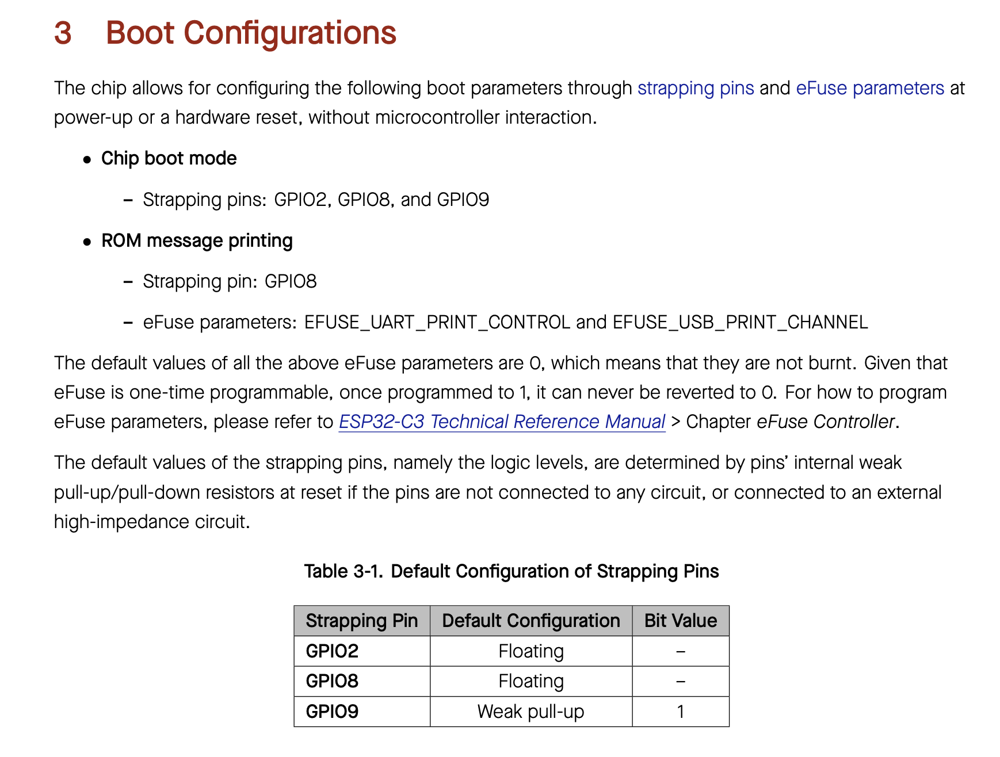

Boot needs a weak pull up resistor so I'm adding 10k ohm. For reset I'm going to add a capacitor of 1uF just to be safe. I am going to create net labels for UORXD and UOTXD. They stand for Receiver and Transmitter respectively. Yeah I'm not sure what to connect it to. For LN_IN that is a radio. I don't have a use so I'll just give it a net label. Maybe I will try to termiante it. No it goes to an antenna. I will add one. I am following the schematic diagram right now. The SPI pins are like flash. I'm adding net labels because the resistors make it look unorganized.

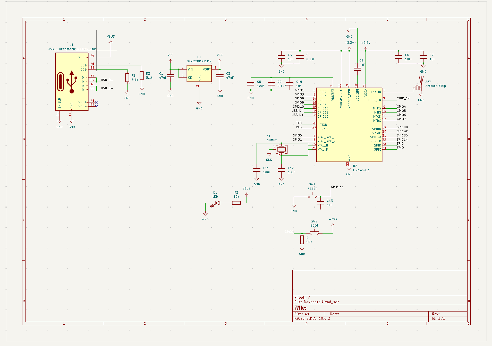

Seems like CHIP_EN is some sort of reset pin. This function of the pin is "High: on, enables the chip (powered up).
Low: off, disables the chip (powered down).
Note: Do not leave the CHIP_EN pin floating"

Some sort of power pin I suppose. I wonder if I need multiple status lights. I'll do two, since this is a small LED. The configuration I have for the LED seems unusual, so I will change it. I will leave one connected to VBUS as an indicator of it being turned on. Maybe one for blink effect too and it'll be blue. It'll be connected to a GPIO pin, wonder which one is open. If space allows, I'll add a green one! I connected the LED to GPIO8.

I noticed a flash when referencing the hardware design guide. I am powering it through USB-C so i dont think I need a flash. I'll still add it just in case. This particular part I picked was from research and it supports 128 something. I'll probably use that much lol

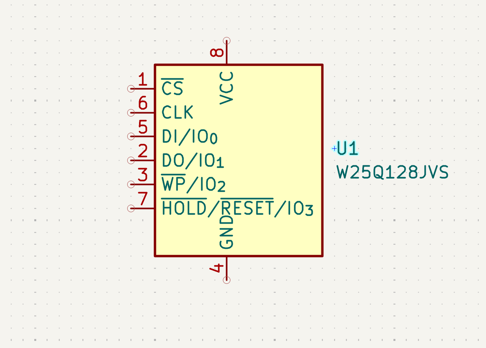

I'm removing the VDD_SPI whatever I put on there. Stil adding a capacitor to stablzie signals. Design gudie says 0 ohms, but another person put 100 on theirs. I'll probably do 0 ohm for mine because it is flexible. ugh but schematic gets crowded. Well I figured it out, I place it real close on the wire lines.

Now I need to move on to whatever's left for the schematic. How many connector pins do I want on my development board. How many pins do I have to connect? Would I put all my pins to one side or on both? Doing male headers because they're more durable and stack some jumpers on top too.

I guess I will add inductors because I cannot omit them as a bare bones chip. The values for RF Antenna is too be decided by the actual PCB traces, and the crystal I must calculate. I think 24nH is an ok value for inductor.

Still thinking about the connectors. I think I have GPIO0, GPIO1, GPIO10, GPIO4, GPIO5, GPIO6, GPIO7, TXD and RXD open. I need to include a place for 3v3 and GND as well. So that's about 9 slots plus 2 more which is 11. Maybe I'll add one more option for VBUS as well. I know there is 5v option but it needs to go downscale in volts... I guess I'll do a lopsided amount of connectors then. GPIO8, GPIO3, GPIO3 are used by the diodes. A symmetrical pattern. Oh! also for boot and reset pins too. Added those! Now it fits.

Wooo here's the schematic so far! I did a lot of organization mostly though. Waiting on specific values for PCB.

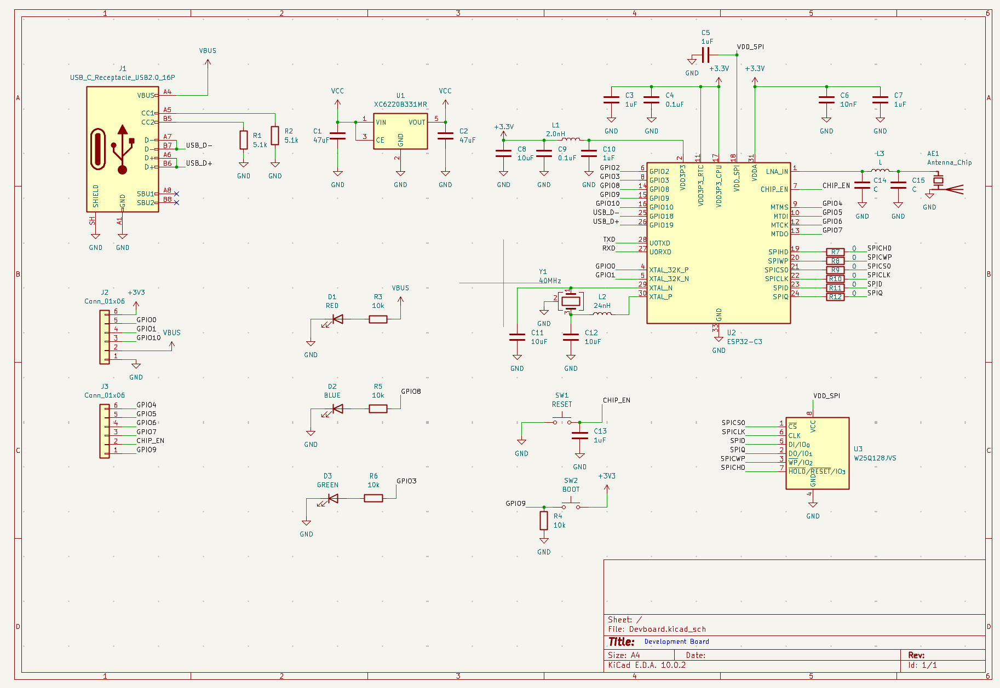

### Time Spent: 2 Hours

## May 16, 2026

I am getting to work by adding power flags. I wonder what shape my PCB should be. Why does my GHND have no input power pin. There seems to be 15 open total pins but I only have 12 at the moment. Adding one more set of connectors. Just want one power source. Then I want four mounting holes. Now I need to assign footprints. I'm going with 0603 footprints because they're simpler to solder. For RF_Antenna footprint I searched it up and it says there are many types. I'm thinking of going with a ceramic antenna since my module may be small. But I'll check the docs just in case. Probably a Johansen connector chip. For mounting holes I'm going with m2 screws because they're most accessible and in between. I need to transfer footprints over.

Spent forever trying to import the easy eda USB-C aghh. figured it out by running python script path and command. Assigned usual footprints. Not sure for mounting holes, buttons and the inductors. I guess I will go with the usual footprint for a button. It looks like 6x6mm is the standard but is not in KiCad by default. I'll use 0201 or 0603 for the inductors. I'm going to use the part number C720477.
Okay i got all of my footprints besides the mounting holes lol.

### Time Spent: ~1 Hour

## May 17, 2026

Adding mounting hole footprint finally. I import them all into the PCB. Now I create a 100mm by 100mm square. Well it has to be under. I'll try a rectangular shape and experiment with board outlines. Mostly filmed on lapse. Need some capacitors to be close together. Also I think it is best to hide silkscreen... Dev boards dont really need silkscreen labels. I have a feeling I want to swap GPIO 10 and CHIP_EN, and swap 3v3 and VBUS because of overlapping ratlines. Ugh I should've picked pins that are next too each other. I'm switching out GPIO8 for something else. Switch to GPIO9 with the boot switch. Then GPIO9 I will swap for... GPIO4 works. Doing a lot of swapping and making sure there aren't duplicates. Not sure for this extra pin connector... I have an extra slot.

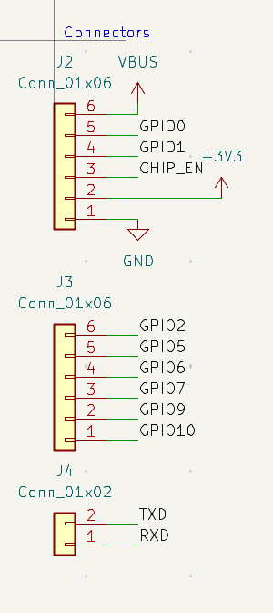

Probably will leave an extra anyways. For the memory flash I think vias are my only option. Perhaps I should go for a 4 layer board. I'll read through the design guide. Forgot to give UATXD a resistor! I need to place my resistors close to the ESP32-C3 for the flash. Definetely need vias and they're ok! GPIO pins last.

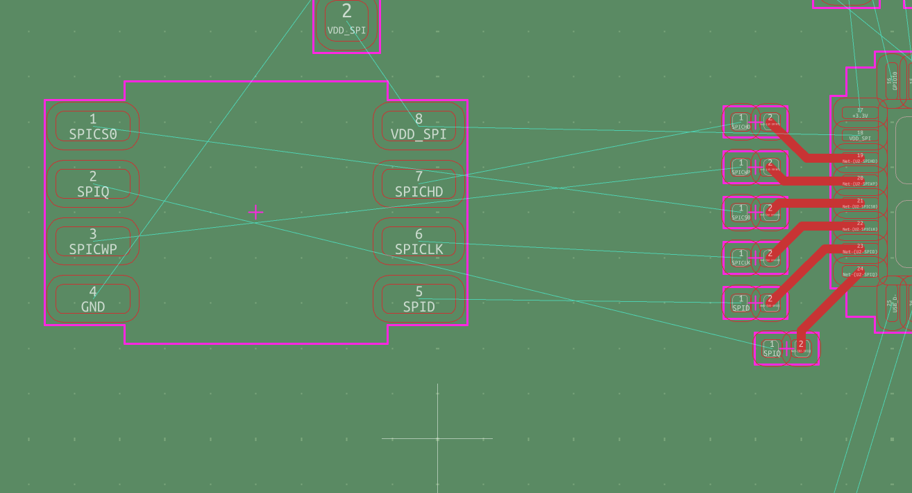

My crystal footprint is giant. The correct package is SMD3225. I'm routing all my power supply on the third layer! With some exceptions. I need to keep the RF and Crystal clean of anything underneath as well.

had to swap some values too liek GPIO because of the ratlines on the schematic.

I hate how I have so many vias. Cant do anything about it. AAAAA And my traces are all weirdly long. I just need to get rid of the silkscreen value designators now. Oh I also need labels for pin headers. Next time...

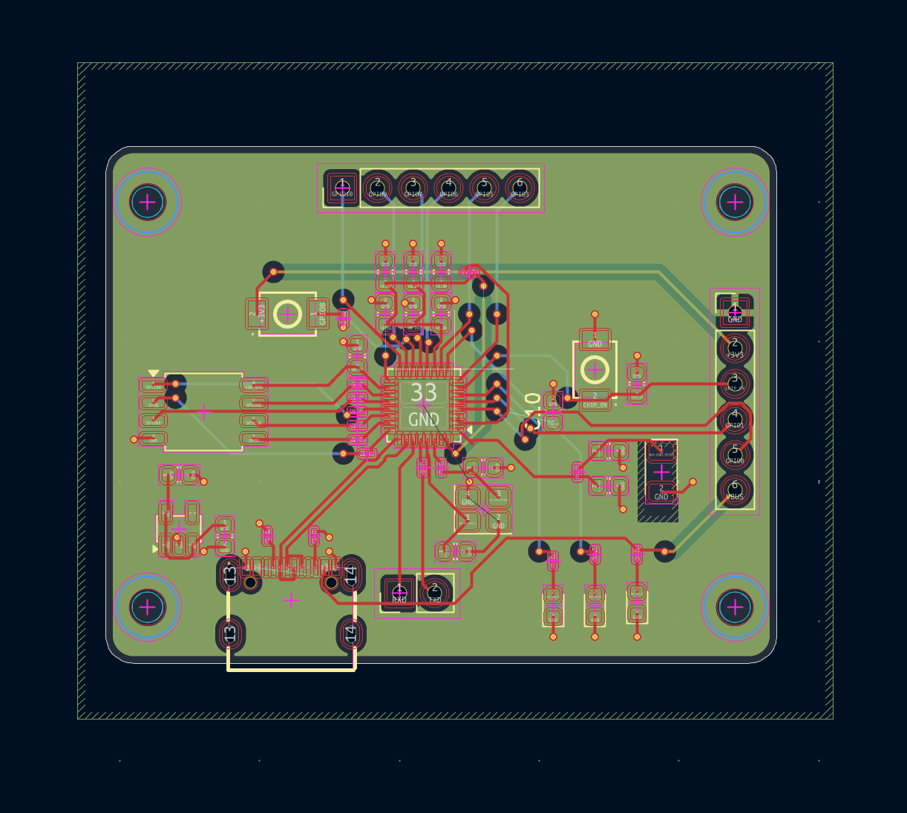

### Time Spent: 4 Hours

## May 18, 2026

Development board here... So close. I added some silskcreen labels and credits to myself for making this cool awesomesauce development board. Would like to add graphics but I'm not feeling it. I put my silkscreen on the top because I want people to see it as form of accessibility. Oh DRC I need to fix the clearance errors. I am searching up JLCPCB clearances. Uh i realized some pads are overlapping. Ok net classes set to 0.09mm clearance as said my JLCPCB. How do I un clear the clearance on my USB-C? Some items forgot to connect so I'm rerouting some areas. It's time I ignore the pad errors from DRC. Now I want to update my GitHub Repo to make it polished! Sparkles!

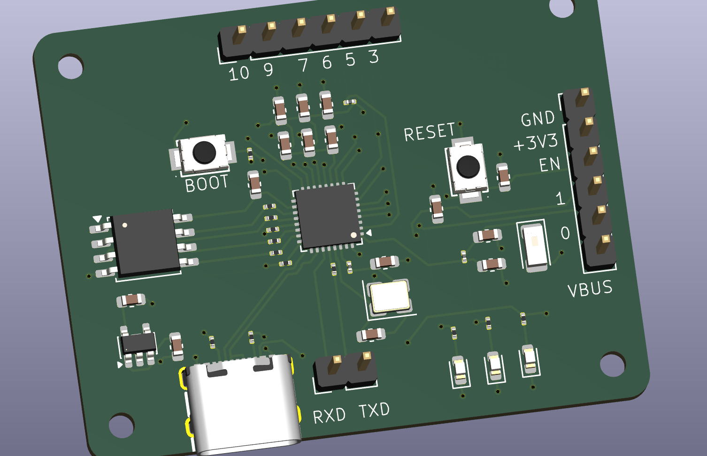

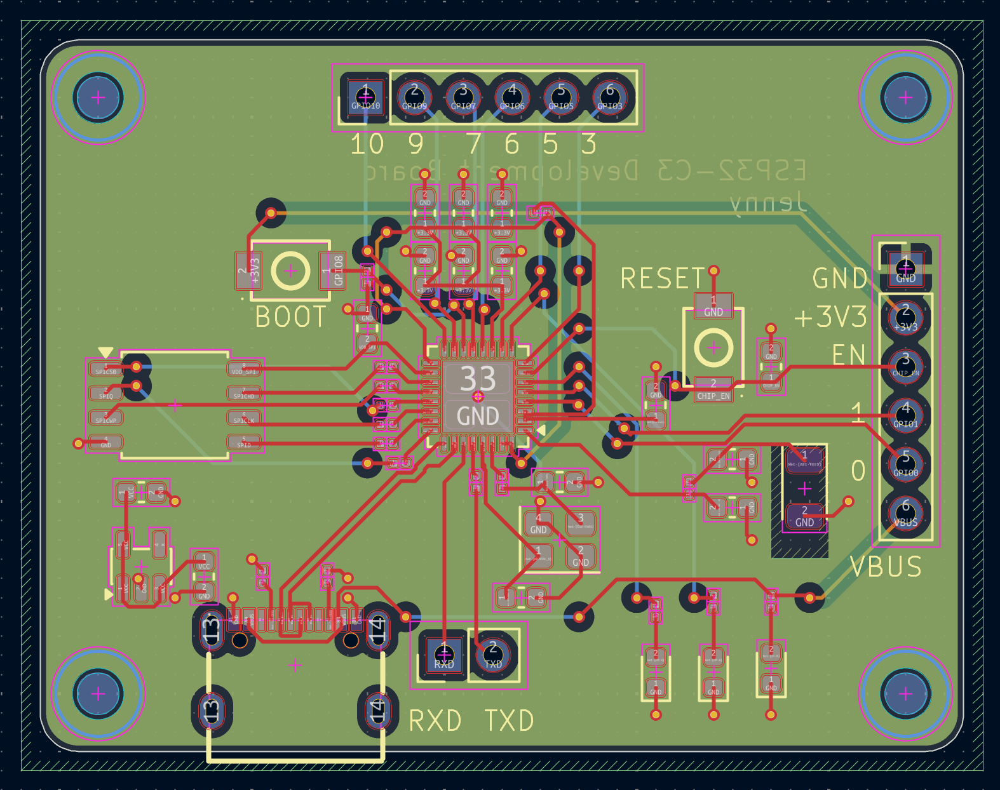

I can see a few maybe unruly routing. But I'm rushing to get this done so I can do homework! I need freedom. I think it still works fine hopefully. One more thing, crystal be in the keep-out zone. So I added it and rerouted some vias too.

Need to work on my BOM next. For mounting hole and Pin header im not going to include them becasue I know a place where to get pin headers. My antenna im not sure i have to look it up. RF components need to be 0201.

Oh wait i still need to calculate the values for c14 and c15. Maybe I will go with L3 value is 2.4nH, both C14 and C15 will have a value of 1.2pF. Just needed to pick something but it is also within range.

47uF C140782
1uF C15849
0.1uF C15849
10nF C100042
10uF C96446
1.2pF C85895
RED LED C19171390
BLUE LED C965807
GREEN LED C19273151
Type-c C2765186
2.0nH C86125
24nH C49247134
3.0nH C98044
5.1k C2907044
10k C2930027
0 ohm C100044 (1%)
499 ohm C2933227
buttons C720477
LDO C86534
ESP32-C3 C2838500
Memory flash C97521
crystal C5444549

Ok that should be all I typed in. Now I find an antenna that works. It has to be 2.4GHz and I found a 1206
SO rf antenna C293767 means I have to change footprint. Doesn't seem to fit what is in the library currently. Come back later

### Time spent: 2.5 Hours