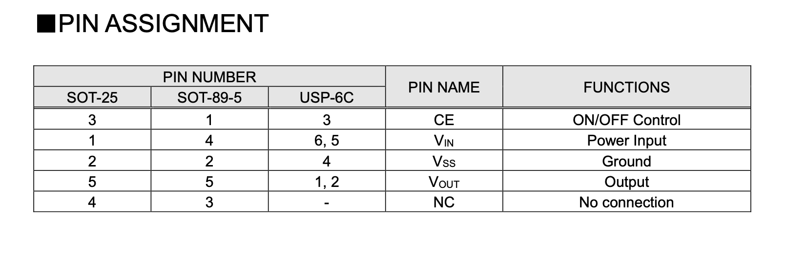

## May 10, 2026
I wonder what dev boards are useful for. What problems do I want to solve? Some features I would add is to make my development board aesthetically pleasing. For easier connectivity I'm going to add USB connectors. Since my computer is primarily USB-C I will use USB-C. Also usb-c is just easier in general. I need a one way usb-c with one way anything. With the intent of adding a case too eventually. I want to protect my devboard in someway. But that means I need to leave slots option for pinouts if I do add them. I think I will go with RP2040 for general purpose. But I need to make it unique in some way. It doesn't have wifi support though. Some applications I want to use my development board might include wifi, for example temperature readings or a wifi-powered clock from the cloud. I think I'll stick with the ESP32.

This ESP32 has an internal 8 MHz oscillator as I read through the datasheet for the ESP32 chip. It does not need an 8 MHz crystal oscillator then. however the addition of external crystal clock sources are typical 160 MHz. so I'm adding a 160 MHz crysal clock source. I picked esp32-d0wd-v3.

I am finding the external crystal clock oscillator I found this one [here](https://www.lcsc.com/product-detail/C43086214.html?s_z=n_q_p_crystal%2520oscillators%2520160&spm=wm.ssy.bg.0.xh&lcsc_vid=QARcUlBTQQQLVlUEEVddVAJXRVhXUwYHT1YKX1xQQAUxVlNRT1VbU1NRQFNcUTsOAxUeFF5JWBYZEEoKFBINSQcJGk4dAgUUFAk%3D)

I think this is unusually a high frequency for crystal oscillator though. I am going to recheck. Besides there's not a lot of stock. Ok I rechecked and it is crystal 40 MHz for wifi or bluetooth. I found another one. It is called [YXC Crystal Oscillators OW2EL89CENUXK7YLC-40M](https://www.lcsc.com/product-detail/C48888233.html?s_z=n_q_p_crystal%2520oscillators%252040mhz&spm=wm.ssy.bg.2.xh&lcsc_vid=QARcUlBTQQQLVlUEEVddVAJXRVhXUwYHT1YKX1xQQAUxVlNRT1VbUlBQQFhfVjsOAxUeFF5JWBYZEEoKFBINSQcJGk4dAgUUFAk%3D) A 4 pin crystal

Now i need a linear regulator between power and mcu which is ESP32. Maximum operating voltage is 3.3v. USB-C supports 5v. I am going from 5v to 3.3v. Uh I'll pick the XC6206 or related because it supports up to specific volts and I want a USB-C connector. There's other manufacturers but this part has more in stock, so more popular. [MSKSEMI XC6206P332MR-MS](https://www.lcsc.com/product-detail/C5252899.html?spm=wm.fly.bg.1.xh___wm.mly.mlk.16-0-0.ml&lcsc_vid=T1UPBgAFQlJbX1JeE1QIVQZeFAcIAwZeQlUPX1BWElcxVlNRQFlbVF1TQlNcUTsOAxUeFF5JWBYZEEoKFBINSQcJGk4dAgUUFAk%3D)

Ok I forgot about the current limits. I wonder if my ESP32 model needs to handle specific levels of current. I went back to power supply and it says

"The operating voltage of ESP32 ranges from 2.3 V to 3.6 V. When using a single-power supply, the
recommended voltage of the power supply is 3.3 V, and its recommended output current is 500 mA or
more."

I need an output current of 500mA or more on ESP32. The previously mentioned LDO is not compatible most likely. I found this one and I'm going to read the datasheet. [TDSEMIC XC6220B331MR](https://www.lcsc.com/product-detail/C22466451.html?s_z=n_q_xc6220&spm=wm.fly.bg.0.xh&lcsc_vid=QARcUlBTQQQLVlUEEVddVAJXRVhXUwYHT1YKX1xQQAUxVlNRT1VbXlFeTlNZVjsOAxUeFF5JWBYZEEoKFBINSQcJGk4NBhADEA4cHktXR1JcSQwSGg0%3D)

It can support up to output of 300mA. For ESP32-C3 the current consumption in active mode for RF is peak 335 mA.

There are too many ESP32 models. Seems I'm looking for MCU specfically. I changed my mind. I pick the ESP32-C3 for wifi compatibility. I'm not intent to make a radio or anything. There is a specific data sheet so I will read it.

I found the hardware design guide. It says the power regulation be no less than 500 mA. This model I found works after some recommendations online. [TECH PUBLIC XC6220B301MR](https://www.lcsc.com/product-detail/C23378035.html?s_z=n_q_xc6220&spm=wm.fly.bg.2.xh&lcsc_vid=QARcUlBTQQQLVlUEEVddVAJXRVhXUwYHT1YKX1xQQAUxVlNRT1VYVlNVR1RYUjsOAxUeFF5JWBYZEEoKFBINSQcJGk4NBhADEA4cHktXR1JcSQwSGg0%3D) I like that it supports up to 900mA and 6v.

### Time Spent: 2 hr

## May 11, 2026

So the LDO I want does not have a footprint in the kicad library. No worries, I found a better alternative! I'm going to use the [XC6220B331MR-G](https://jlcpcb.com/partdetail/TorexSemicon-XC6220B331MRG/C86534) because it can support up to 1000mA! That's more than what I need but you never know. Just in case. I'm going to import this into the KiCad library.

I'm going to add a crystal somewhere too. It seems the one I picked contains 4 pinouts. So I will import a symbol with 4 pins as crystal. Actually it's a 3 pin because one of the pin is a no connect. Also I am not sure where the mcu pinout is so I'm reading the diagram right now.

The document mentions about an analog pin called XTAL_N and XTAL_P which is connected to "external clock input/output connected to the chip's crystal or oscillator. P/N means differential clock positive negative"

And XTAL_32K_N and XTAL_32K_P for a 32kHz external clock input or output connected to ESP32-C3's crystal or oscillator.

I think I'm not going for the 32kHZ external clock because I have a 40 MHz crystal. Connecting it to XTAL_N and XTAL_P.

LDO pin I find out

I don't know what CE and Vout goes to so I'll come back later.

Uh oh I read through the XC6220 and it's PCBA only. Come back later. Anyways I since the USB-C says VBUS I changed it to VBUS. I also have CC1 and CC2 but wired it to 5.1k pullup resistors as usual

My LDO needs capacitors to store some energy. I checked the data sheet and it says

Maybe 47uF? Since it says voltage out. So I'm picking a 47uF capacitor then. But where does this go? After some researching, it seems my capacitor size depends on the crystal I have... I can 47 from what's recommended. It's hard to read. Datasheet wants a capacitor between VIN and VSS (ground). Same for VOut and VSS. Will also add somne net labels to the USB-C. I still have a CE pin left floating. It's an input pin. I will connect to Vin to keep it constantly on so it is open.

I'm moving on to the MCU. I have a lot of pins that start with V. Let's start by reading the datasheet and seeing what it says.

### Time Spent: 1 Hour